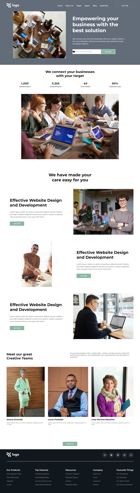
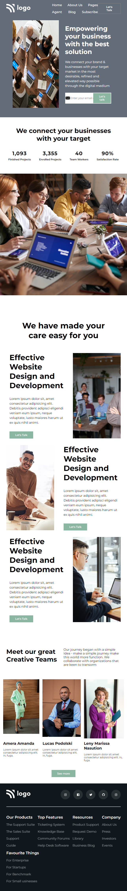

# PRANAV MATHUR

## Learnings from the project:

- Responsive layout design
- Using the 'overflow: hidden' property to correctly display an image without disturbing the layout

## Time taken:

    It took me 6-8 hours to complete this project.

## Screenshots:

## Live link:

[Go to site](https://business-landingpage-012.netlify.app/)
